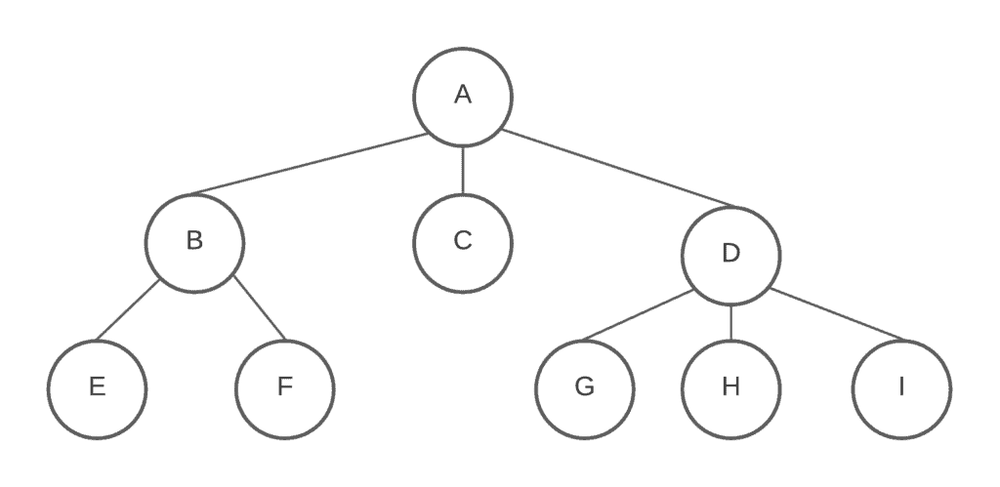
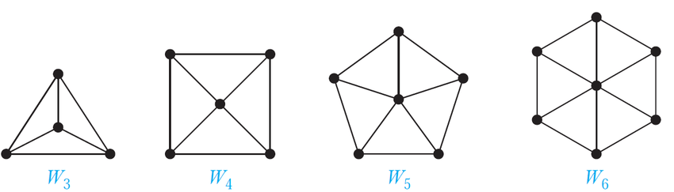
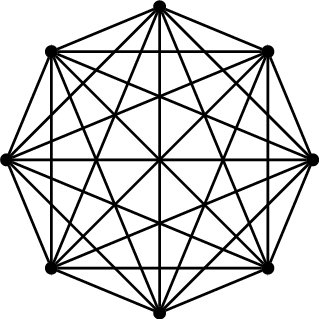
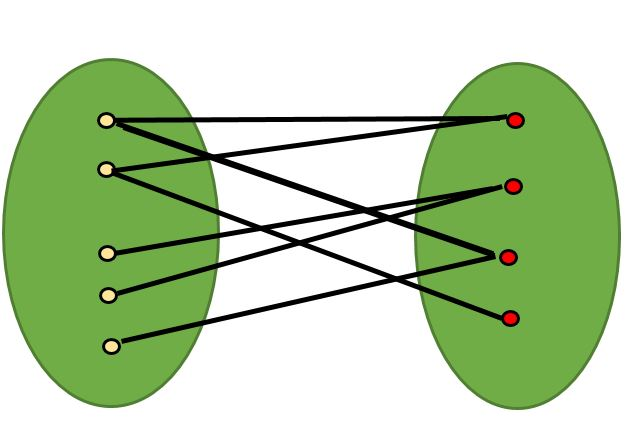

# Preparation
````
Install font in folder resources/fonts
````

# project1-1-CS03-graph-color

This project implements 2 algorithms to calculate the **chromatic number** of a graph. The chromatic number is the minimum number of colors required to color the vertices of a graph such that no two adjacent vertices share the same color.

# What is Chromatic Number?
The chromatic number of a graph G, denoted as χ(G), is the minimum number of colors required to color the vertices of a graph G in such a way that no two adjacent vertices share the same color. Formally, it is the smallest positive integer k for which there exists a proper vertex coloring with k colors.

- The chromatic number is an essential parameter that captures the inherent colorability of a graph.
- It provides insights into the structural properties and relationships within the graph.

## Examples:
graph:
```
        (1)----(2)
        / \     / \
      (3)  (4)-(5)-(6)
       |    /\  | /
      (7)(10)-(9)
       |    
      (8)
```
This is the adjacency matrix representing the graph:

|   | 1 | 2 | 3 | 4 | 5 | 6 | 7 | 8 | 9 | 10 |
|---|---|---|---|---|---|---|---|---|---|---|
| 1 | 0 | 1 | 1 | 1 | 0 | 0 | 0 | 0 | 0 | 0 |
| 2 | 1 | 0 | 0 | 0 | 1 | 1 | 0 | 0 | 0 | 0 |
| 3 | 1 | 0 | 0 | 0 | 0 | 0 | 1 | 0 | 0 | 0 |
| 4 | 1 | 0 | 0 | 0 | 1 | 0 | 0 | 0 | 1 | 1 |
| 5 | 0 | 1 | 0 | 1 | 0 | 1 | 0 | 0 | 1 | 0 |
| 6 | 0 | 1 | 0 | 0 | 1 | 0 | 0 | 0 | 1 | 0 |
| 7 | 0 | 0 | 1 | 0 | 0 | 0 | 0 | 1 | 0 | 0 |
| 8 | 0 | 0 | 0 | 0 | 0 | 0 | 1 | 0 | 0 | 0 |
| 9 | 0 | 0 | 0 | 1 | 1 | 1 | 0 | 0 | 0 | 1 |
| 10 | 0 | 0 | 0 | 1 | 0 | 0 | 0 | 0 | 1 | 0 |

# Algorithm to find Chromatic Number of a graph.

## 1.Using Backtracking Algorithm (exact algorithm)
### Follow the given steps

1. Translate the graph.txt into a graph matrix.
2. Create a recursive function that takes graph, current vertex, colour set and current color.
3. If the current vertex is last vertex of the graph, print the chromatic number of the graph.
4. Assign a color to a vertex from range 1 to n.
    - For every assigned color, check the configuration is safe (there is no neighbor vertices that have the same colour) and recursively call the function with the next vertex and the graph.
    - If any recursive function return true then break the loop and return true.
    - If recursive function false, assign the current vertex with different colour and recursively call the function again.

# 2. Using Welsh-Powell Algorithm (Estimation)
### Follow the given steps

1. Convert the graph.txt into a vertices and edges class.
2. Find the degree of each vertex
3. List the vertices in the ascending order of their degrees
4. Colour the vertex at the top of the list with colour 1
5. Continue down the list, colouring each vertex that is not connected to any other vertex with that colour
6. Redo step 5 but with the next colour, do this until each vertex is coloured
7. Once each vertex is coloured, the estimated chromatic number will be the colour variable
   This algorithm returns a rough estimation of the chromatic number, not the exact.

### Examples:
The Degree array of the graph:
| Vertex | Degree |
|---|---|
| 9 | 4 |
| 5 | 4 |
| 4 | 4 |
| 6 | 3 |
| 2 | 3 |
| 1 | 3 |
| 10 | 2 |
| 7 | 2 |
| 3 | 2 |
| 8 | 1 |

After the Welsh-Powell Algorithm:
| Vertex | Degree | Colour |
|---|---|---|
| 9 | 4 | 1 |
| 5 | 4 | 2 |
| 4 | 4 | 3 |
| 6 | 3 | 3 |
| 2 | 3 | 1 |
| 1 | 3 | 2 |
| 10 | 2 | 2 |
| 7 | 2 | 1 |
| 3 | 2 | 3 |
| 8 | 1 | 2 |

This algorithm does not always return the exact result. If the degree list is ordered slightly differently, it can return different results.


# How to run the code?
Run these lines in the command prompt
```
javac ReadGraph.java
java ReadGraph "filename that contains graph"
```
## Example:
```
>> javac ReadGraph.java
>> java ReadGraph graph.txt
// Number of vertices = 6
// Expected number of edges = 7
// Reading edge 1
// Edge: 1 2
// Reading edge 2
// Edge: 2 3
// Reading edge 3
// Edge: 3 1
// Reading edge 4
// Edge: 1 4
// Reading edge 5
// Edge: 4 5
// Reading edge 6
// Edge: 5 6
// Reading edge 7
// Edge: 6 4
Chromatic Number: 3
```

# How to run the actual game?
## Preparation
In order to run the game itself we need to prepare the IDE for it. No needed to say that we need to have javafx SDK installed in our machine, and the java JDK also downloaded.
### VSCode preparation
For VS code we need to open the javafx (project) folder and go to the .vscode directory in the folder. There we are going to encounter a file called launch.json which we need to make it look like this:


Where "D:/Commands/JavaLib/javafx-sdk-23.0.1/lib" is the directory of the folder called "lib" inside our javafx SDK in out machine. Also we need to add the java references libraries in the IDE itself.

Once all that is done, our code is ready to run is VSCode
### IntelliJ IDEA preparation
For IntelliJ IDEA is a little bit different. First we open our javafx (project) folder, once it's opened we are going to figure the App.java is underlined by a red line.


We open it in our editor and click where says "edit configuration" in the photo above.
Then we create a new configuration for the file.


We click where it says "Modify options" and we check "Add vm options" is clicked.

Then under the SDK we choose java 23, under the main class selector we choose "page.app", and finally in the second text field we type the following:
```
--module-path /Users/javierrueda/Downloads/javafx-sdk-23.0.1/lib --add-modules=javafx.controls
```
Where again "/Users/javierrueda/Downloads/javafx-sdk-23.0.1/lib" is the directory of the folder called "lib" inside our javafx SDK in out machine.

Once all that is finished it should look like this:


Then we apply and save the changes and out code is ready to run.

# Model Detection Algorithm
## Tree Graph (Chromatic Number is 2)


1. Checking if the graph is cycle using DFS. If the graph is cycle, return false.
2. Checking if is there any unexplored vertices. If there is any unexplored vertices after DFS algorithm then it is not a tree graph.
## Wheel Graph (Chromatic Number is 3 and 4, if n is odd and even respectively)


1. Finding the center with the largest degrees, if there is more than 2 centers return false.
2. If the “number of vertices around center” is equal to “number of vertices - 1” return true, otherwise return false.
## Complete Graph (Chromatic Number is equal to number of vertices)



1. Run a loop through adjacent matrix and count the number of connections for each vertex. If the "number of connections" is not equal to "number of vertices", return false.
2. If the algorithm completes without any conflicts, return true.
## Bipartite Graph (Chromatic Number is 2)


1. Start BFS from any vertex and assign it to color 0.
2. For each vertex, color its uncolored neighbors with color 1. If is there any neighbors have the same color as the current vertex, return false.
3. If BFS completes without any conflicts, return true.


